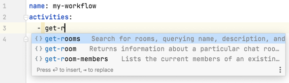

# Concepts

At the lowest level, the Symphony platform is extensible via public HTTP APIs. Bots used the APIs to interact with
end-users or even other bots. To facilitate the development of bots, the Symphony Bot Developer Kit (BDK) was introduced
providing language specific bindings ([Java](https://github.com/finos/symphony-bdk-java)
, [Python](https://github.com/finos/symphony-bdk-python)) for those APIs as well as starters or even framework
integrations to bootstrap applications.

To accelerate the development of bots, the WDK, built on top of the BDK takes it one step further by enabling developers
to **create applications without writing code**. Workflows are written in a declarative manner, giving access to most of
the Symphony APIs to react on events and perform actions as common as sending messages to users.

Workflows are executed by a generic bot that runs a workflow execution engine. As a workflow developer, you simply write
workflows in files and provide them to the bot for execution.

## Workflows

Workflows are primarily written in SWADL, a declarative format based on YAML, for now. They are mostly made of
activities, the actions a workflow will execute.

### SWADL

The Symphony Workflow Automation Definition Language or **SWADL** for short is the format used to write workflows. It is
simply [YAML](https://yaml.org/) that we picked for its brevity, popularity and support of comments (that will come
handy to maintain complex workflows!).

We defined SWADL as a [JSON Schema](https://json-schema.org/) that is supported by a variety of editors (including
Visual Studio Code with an [additional plugin](https://github.com/redhat-developer/vscode-yaml) to install
and [Intellij IDEA](https://www.jetbrains.com/help/idea/json.html#ws_json_using_schemas)) so that as a workflow writer
you get autocompletion, documentation and validation on the fly.



Workflow files are usually suffixed _.swadl.yaml_ so that they can be associated with the JSON Schema automatically and
deliver the best editing experience.

<!-- TODO how to configure it? --> 

### Workflow instances

Workflows are executed by the workflow bot. First the workflow definition as a SWADL file is deployed to the bot, then
incoming events can trigger the execution of workflows. A workflow is said to be instantiated when it is executed so at
any given time you will find that the workflow bot holds reference to workflow deployments as well as workflow instances
running or finished.

Let's say we deploy this workflow:

```yaml
activities:
  - send-message:
      id: pingPong
        on:
          message-received:
            content: /ping
      content: "Pong"
```

Now in any conversations the workflow bot is part of, if the message _/ping_ is sent, the bot will reply with _Pong_.
Each received _ping_ message creates a workflow instance and executes the `pingPong` activity.

## Activities

Activities are the building blocks of workflows, the actions to be performed. For instance the most commonly used
activity for a bot interacting with end-users is probably the `send-message` activity.

An activity usually takes some inputs, for instance the `send-message` activity will take the content of the message as
an input. Depending on the performed action it can generate [outputs](#outputs) such as the sent message for
the `send-message` activity. Activities also have common properties such as an `id` which will be useful to reference it
elsewhere in the workflow (to access the activity's outputs for instance).

In a workflow, activities are often defined sequentially, one after another. Once an activity completes, the next one is
executed. In the [Events](#events) section more details are provided on how activity executions can be controlled.

### Custom activities

The WDK comes with a predefined set of activities, most of them giving access to the public Symphony APIs. As a workflow
developer you might want to implement your own logic and reuse it in
workflows. [Custom activities](./custom-activities.md) are supported and can be added to the workflow bot without
changing it.

### Script activity

The script activity (`execute-script`) is a specific activity that is useful to glue activities together or debug
workflows. It lets you use a [Groovy](https://groovy-lang.org/) script as an input with access to the workflow
instance's variables and even BDK services. In case you are familiar with Java programming, Groovy can be seen as
scripting for Java with a lot of syntax sugar.

While it can be tempting to do many things in script activities we do not recommend having long scripts in the middle of
workflows. In the long term they can be difficult to maintain and to test. If a script starts to grow bigger than a
dozen lines maybe a custom activity should be considered instead.

You'll find various usages of it in the [examples](./examples) we provide.

## Events

A workflow requires at least one starting event, used to create a workflow instance from a deployed workflow and to
start executing activities. This means the first activity of a workflow must define at least one event.

Workflow activities are executed sequentially by default meaning the default event (if no others are defined) for an
activity is the `activity-completed` one with completed activity id being the activity declared before.

```yaml
activities:
  - send-message:
      id: sendHello
      on:
        message-received:
          content: /hello
      content: "Hello"
  - send-message:
      id: sendBye
      content: "Bye"
```

In the example above, `sendHello` is executed first when a _/hello_ message is sent, then `sendBye`.

Intermediate events can be defined too, for instance for a workflow when the user has to provide multiple inputs to move
through the activities or if the workflow sent a form and is waiting for a reply.

```yaml
activities:
  - send-message:
      id: sendHello
      on:
        message-received:
          content: /hello
      content: "Hello"
  - send-message:
      id: sendBye
        on:
        message-received:
          content: /bye
      content: "Bye"
```

In the example above, `sendHello` is executed first when a _/hello_ message is sent, then the workflow waits for another
message (_/bye_) to execute `sendBye`.

### Datafeed events

Most of the events a workflow will react on are datafeed events such as message received, user joined room, connection
requested... The workflow bot is listening for any datafeed events its service account can receive and then dispatch
them to the appropriate workflows.

### Timers

Two timer based events are supported:

- at a specific time, to execute an activity at a given point in time
- recurring time, to execute an activity repeatedly, similar to a cron job

Usually the first activity of the workflow defines a timer based event so the workflow is started at a given time, for
instance every monday to send a weekly report to users.

### Activities execution

While the default order of execution for activities is sequential more complex use cases can require controlling the
execution of activities.

#### Branching

Conditional execution of activities is controlled via conditions applied at event level. Multiple conditions can be
defined to express an if/else if structure. The default execution in case conditions evaluate to false can be expressed
too (i.e an else).

<!-- TODO link to examples --> 

#### Loops

Loops are defined via events too. A loop is simply an `activity-completed` event referencing an activity defined
afterwards in the workflow. A condition can be applied to this event to decide if the loop continues or exists.

<!-- TODO link to examples -->

## Forms

Sending a form in a workflow is done using the `send-message` activity where the form is simply MessageML content using
[form elements](https://docs.developers.symphony.com/building-bots-on-symphony/symphony-elements).

Receiving form replies is done with the `form-replied` event. The catch is that multiple users can reply to a form if it
is sent to a room or a MIM. Therefore, an activity waiting for a reply can be executed multiple times as long as the
form is still active (it comes with a timeout and will expire at some point). For each reply, one or more activities can
be executed. Using the `activity-completed` event, other activities can then be executed once the form expired.

<!-- TODO link to examples -->

## Variables

Variables are a powerful way to pass data around in activities. They can be used as input parameters for activities, to
retrieve the outputs of activities as well as a way to control the flow of activities.

Variables exist within the scope of a workflow instance and are resolved at runtime, meaning activities can change their
values. Those changes will be reflected in subsequent activities.

```yaml
variables:
  userName: "John"
activities:
  # ... an activity with a starting event is missing here 
  - execute-script:
      id: changeVariable
      script: |
        variables.userName = variables.userName.toUpperCase()
  - execute-script:
      id: printVariable
      # Will print "JOHN"
      script: |
        println variables.userName
```

Be aware that variables are serialized and passed around between activities. They are expected to contain small amount
of data and should not for instance be used for large files.

### Workflow level

Variables can be defined at the workflow level and will be created automatically once a workflow instance is started.

```yaml
variables:
  userId: 123
  userName: "John"
activities:
# ...
```

### Outputs

Activities are often returning results, let alone the activities prefixed with `get-`. Those results are stored as
variables, prefixed with the activity's id.

Activity's outputs are documented in details in the SWADL reference.
<!-- TODO link to references -->

### Event

It can also be convenient to access the event that started the workflow or a specific activity. The latest received
event for a workflow is accessible via a specific variable named `event`.

### Conditions

Behind the usage of variables lies an expression language engine meaning it can also be used to evaluate conditions. If
conditions to execute an activity conditionally can be expressed as `${variables.userId == 123}` for instance.
